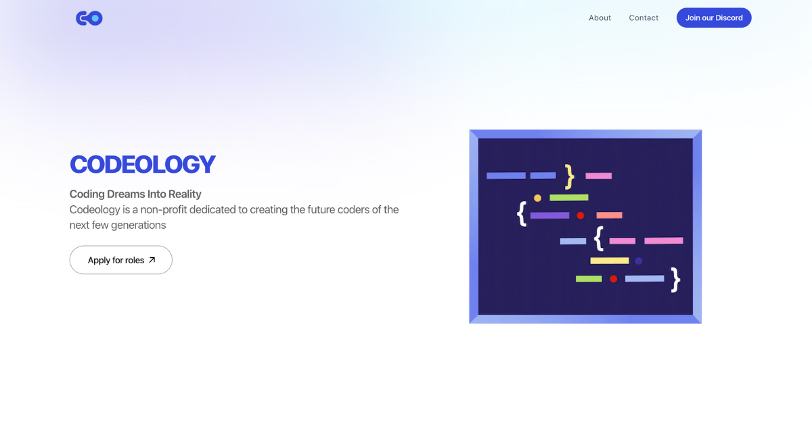

# Codeology



Codeology is a non-profit organization dedicated to creating future coders by providing free tutoring lessons to individuals aged 5-29 in various coding languages. This repository contains the source code for the Codeology website.

## 🚀 Technologies

- [Astro](https://astro.build)
- [Tailwind CSS](https://tailwindcss.com)
- [Vite](https://vitejs.dev)
- [Contentful](https://www.contentful.com)

## 📦 Installation

1. Clone the repository

```bash
git clone https://github.com/lumamontes/codeology
```

2. Install dependencies

```bash
cd codeology
pnpm install
```

3. Start the development server

```bash
pnpm run dev
```

## 🧞 Commands

All commands are run from the root of the project, from a terminal:

| Command                    | Action                                           |
| :------------------------- | :----------------------------------------------- |
| `pnpm install`             | Installs dependencies                            |
| `pnpm run dev`             | Starts local dev server at `localhost:4321`      |
| `pnpm run build`           | Build your production site to `./dist/`          |
| `pnpm run preview`         | Preview your build locally, before deploying     |
| `pnpm run astro ...`       | Run CLI commands like `astro add`, `astro check` |
| `pnpm run astro -- --help` | Get help using the Astro CLI                     |

## 🫂 Contributing

Contributions are welcome! Feel free to open issues or submit pull requests.
